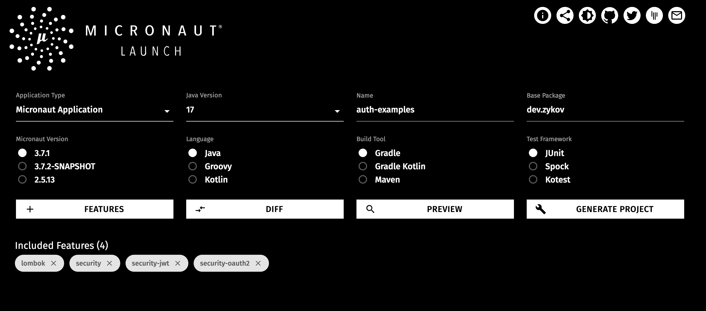
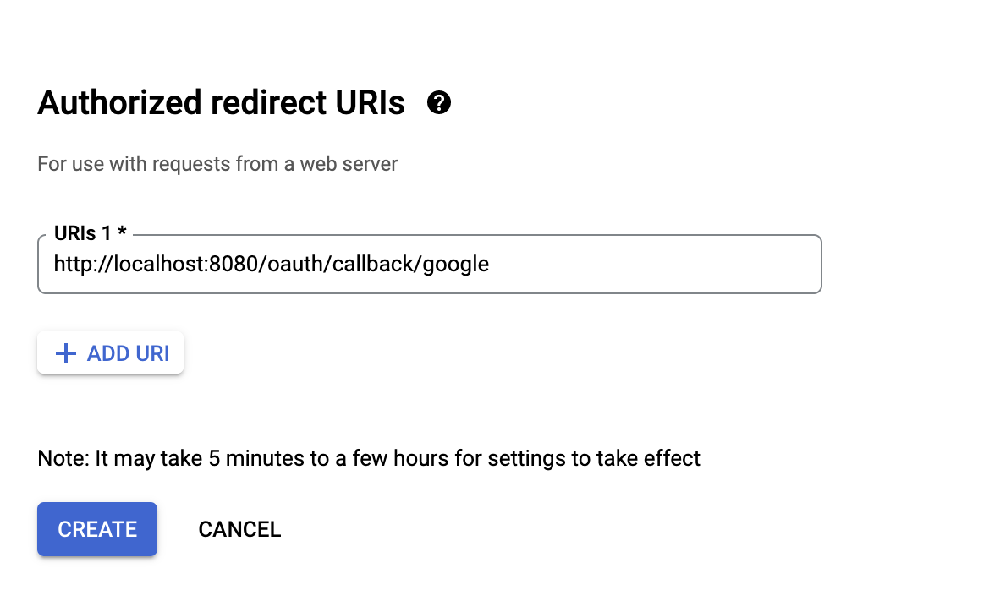
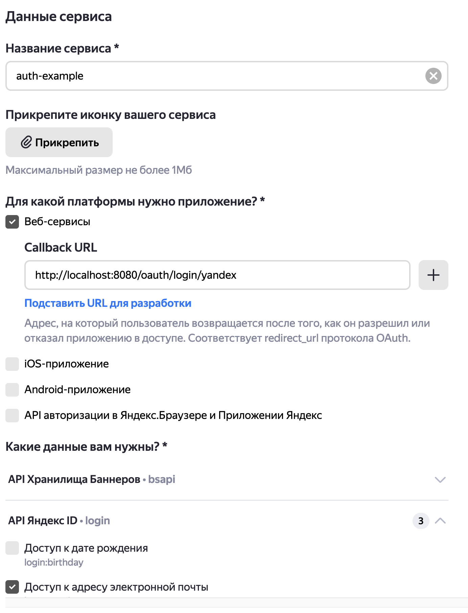

Хочу познакомить вас с модулем аутентификации Micronaut и заодно продемонстрировать, как настроить OAuth2.0 у нескольких провайдеров.

Для начала немного информации:

Micronaut это современный JVM фреймворк, который в данный момент активно разрабатывается. Есть интересная [статья](https://habr.com/ru/post/418117/) про Micronaut.

* Какие провайдеры будут?
  * Google (OpenID)
  * Yandex
* Что потребуется:
  * JDK 8+
  * Micronaut 3.7.0+
  * Ваш любимый редактор кода
  * Традиционные 15 минут свободного времени

## Конфигурация Micronaut

Для того чтобы собрать проект на Micronaut, можно использовать несколько инструментов:

* [Micronaut Launch](https://micronaut.io/launch) - сайт для сбора приложения, аналогичный Spring Initializr.
* CLI - command line interface от Micronaut.
* [SDKMAN!](https://sdkman.io/) - инструмент для параллельного менеджмента различных версий одного и того же SDK на одной машине (чаще всего UNIX)

Я буду использовать первый вариант, потому что мне он кажется самым удобным, особенно для первого запуска. Для этого заходим на сайт, и добавляем нужные фичи будущего приложения. В рамках текущей статьи нужно выбрать три зависимости:

* security;
* security-jwt;
* security-oauth2

Так же я использую Lombok, поскольку он позволяет уменьшить количество boilerplate кода. Так что можете добавить его тоже.

Осталось выбрать версию Java и название проекта. Choose what you want.

В итоге должно получиться что-то вроде этого:



Соответственно, остается только нажать кнопку __Generate Project__, и сайт предложит скачать его или выложить на GitHub. [Тут](https://github.com/jz36/auth-examples) репозиторий на эту статью с примерами кода.

Так же давайте добавим некий контроллер, который позволит нам поприветствовать только что аутентифицированного пользователя:

```
@Controller
@Secured(SecurityRule.IS_AUTHENTICATED)
public class MainController {

    @Get
    public String greeting(Authentication authentication) {
        return "Hello, " + authentication.getName() + "!";
    }
}
```

## Реализация провайдеров

Для реализации аутентификации через сторонних провайдеров, необходимо для начала зарегистрировать у них приложение, которое и будет осуществлять механизм идентификации пользователя через внешнюю систему. Первым на очереди будет Google. Во-первых, это один из самых популярных сервисов, которые есть в мире, и скорее всего, у большинства ваших потенциальных пользователей есть Google аккаунт. Во-вторых, он реализует особую спецификацию OAuth2.0 под названием OpenID. Вот [хорошая статья](https://habr.com/ru/post/491116/), которая рассказывает об этих стандартах.

Ну а мы приступаем к написанию аутентификации через Google.

### Google

Подробно расписывать получение клиента для аутентификации от Google я не вижу смысла. Как минимум, там относительно простой и интуитивно понятный интерфейс, к тому же в [интернете](https://developers.google.com/identity/openid-connect/openid-connect) уже есть подробное описание всех действий.

Стоит сказать что нужно внимательно отнестись к `callback url`. В процессе аутентификации провайдер сходит на ваш сервер, чтобы узнать, не являетесь ли вы злоумышленником. Сейчас нужно выставить `http://localhost:8080/oauth/callback/google`, но на проде советую так не делать.



После этого надо переместиться в `application.yml` и прописать `client-secret` и `client-id`, которые показываются после создания Credentials.

```
micronaut:
  security:
    oauth2:
      clients:
        google:
          client-id: your-client-id
          client-secret: your-client-secret
          openid:
            issuer: https://accounts.google.com
```

В принципе, самый простой вариант уже готов, и вы можете попробовать запустить наше приложение, а затем через браузер сходить на адрес `http://localhost:8080/oauth/login/google`.

Но можно так же сделать более тонкую настройку, например, выдачи ролей пользователю. Для этого потребуется написать `UserDetailsMapper`:

```
@Named("google") // Bean должен иметь данную аннотацию с тем же значением, которое было написано в файле конфигураций
@Singleton
public class OpenIdUserDetailsMapper implements OpenIdAuthenticationMapper {

    @Override
    @NonNull
    public AuthenticationResponse createAuthenticationResponse(
        String providerName,
        OpenIdTokenResponse tokenResponse,
        OpenIdClaims openIdClaims,
        @Nullable State state
    ) {

        return AuthenticationResponse.success(
            openIdClaims.getName(),
            Collections.singletonList("ROLE_GOOGLE")
            );
    }
}
```

На всякий случай уточню, что создание такого обработчика опционально для Open Id провайдера. Теперь, если перейти по контроллеру, который мы объявили ранее, сначала надо будет подтвердить свое желание войти через Google, а после увидеть приветствие от приложения:

```
Hello, Иван Зыков!
```

Другими примерами провайдеров, реализующих OpenID, могут выступать GitHub, Okta, KeyCloack.

### Yandex

Приступим к следующему провайдеру. Для начала так же необходимо создать клиента в системе Yandex. Для этого можно прочитать [инструкцию](https://yandex.ru/dev/id/doc/dg/oauth/tasks/register-client.html). На самом деле процесс схож с Google. Вводим имя приложения, его тип, добавляем необходимые для вашего приложения доступы, а так же определяем `callback url`. В результате должно получиться примерно так:



Следующий шаг - заполнить необходимые параметры в `application.yml`. Так как Yandex реализует только OAuth2.0, а не OpenID, нужно указать больше параметров, чем в предыдущем разделе.

Минимально необходимой конфигурацией для OAuth2.0 приложения в Micronaut является:

* установить параметр endpoint'а для авторизации
* установить параметр endpoint'а для получения токена
* добавить `client-id` и `client-secret`, полученные ранее
* реализация `OauthAuthenticationMapper`

Таким образом получится следующая запись:

```
yandex:
  client-id: ${YANDEX_CLIENT_ID}
  client-secret: ${YANDEX_CLIENT_SECRET}
  authorization:
    url: https://oauth.yandex.ru/authorize
  token:
    url: https://oauth.yandex.ru/token
    auth-method: client-secret-post
  scopes: # этот параметр опционален, его указывать необязатльно
    - "login:birthday"
    - "login:email"
    - "login:info"
    - "login:avatar"
```

Вы могли заметить, что я появился новый еще один параметр, который до этого в статье не упоминался. Это `token.auth-method` - свойство, отвечающее за то, как будет аутентифицироваться наше приложение при выпуске токена в провайдере. Всего в Micronaut существует 7 способов, найти их можно [тут](https://micronaut-projects.github.io/micronaut-security/3.8.0/api/io/micronaut/security/oauth2/endpoint/AuthenticationMethod.html). Вообще, подробной информации о методах аутентификации нет в стандарте [RFC 6749](https://tools.ietf.org/html/rfc6749#section-3.2.1), который как раз и описывает работу OAuth2.0. Каждый волен делать, как хочет. Однако, большинство провайдеров используют `client_secret_post`, в котором `client-id` и `client-secret` передаются в теле запроса, либо же используется `client-secret-basic`, где те же параметры передаются в виде Basic аутентификации.

После того как были внесены необходимые данные в `application.yml`, `Micronaut` требует, чтобы был реализован `OauthAuthenticationMapper`. Давайте к этому и приступим. Данная реализация должна иметь специальную аннотацию `@Named`, в которой значение должно совпадать с именем провайдера, указанного в конфигурационном файле.

Задача этого маппера сконвертировать `TokenResponse` в `Authentication`. В дальнейшем это приведет к тому, что будет происходить вызов некоторого API у провайдера для того, чтобы получить информацию о пользователе. Как только она будет получена, будут созданы `user details`, в соответствии с написанным кодом.

Чаще всего это используется для того, чтобы скомбинировать данные от провайдера с уже существующими записями в БД, либо же создать новую запись и дать пользователю права, аватарку, ник и т.д. В `Authentication` будут храниться следующие стандартные свойства - `username`, `roles` и `attributes`. Далее эти данные будут доступны из любого контроллера, который принимает `Autentication` в качестве параметра.

Для начала нужно создать класс, представляющий данные пользователя от провайдера:

```
@Introspected
@Data
@AllArgsConstructor
@NoArgsConstructor
public class YandexUser {

    private String id;

    @JsonProperty("first_name")
    private String firstName;

    @JsonProperty("last_name")
    private String lastName;

    @JsonProperty("display_name")
    private String nickName;

    @JsonProperty("default_email")
    private String email;
}
```

Потом нужно сделать `HttpClient` для выполнения запроса:

```
@Header(name = "User-Agent", value = "micronaut")
@Client("https://login.yandex.ru")
public interface YandexApiClient {

    @Get("/info")
    Flowable<YandexUser> getUser(@Header("Authorization") String authorization);
}
```

И финальный шаг - создание _user details mapper_, который при использовании клиента сможет выписать пользователю `Authentication`:

```
@Named("yandex") // Bean должен иметь данную аннотацию с тем же значением, которое было написано в файле конфигураций
@Singleton
@RequiredArgsConstructor
public class YandexUserDetailsMapper implements OauthAuthenticationMapper {
    private final YandexApiClient yandexApiClient;

    @Override
    public Publisher<AuthenticationResponse> createAuthenticationResponse(
        TokenResponse tokenResponse, @Nullable State state) {
        return Flux.from(yandexApiClient.getUser("OAuth " + tokenResponse.getAccessToken()))
            .map(user -> {
                List<String> roles = Collections.singletonList("ROLE_YANDEX");
                return AuthenticationResponse.success(user.getNickName(), roles);
            });
    }
}
```

Проверить работу можно аналогично Google, просто сходить по адресу `http://localhost:8080/oauth/login/yandex`, и подтвердив свое желание аутентифицироваться через Yandex, увидеть приветствие.

## Процесс аутентификации

Настало время поговорить о том, как устроена аутентификация `Micronaut` внутри. Отчасти, мы уже немного затронули эту тему, когда создавали пользователя через `UserDetailsMapper`. Существует объект `Authentication`, который хранит данные о пользователе. Но что же происходит под капотом? Давайте разберем!

Для начала установим логгирование на уровень `trace`. Я использую `logback`, так что я просто добавлю такую строчку:

```
    <logger name="io.micronaut.security" level="trace"/>
```

Запустим и посмотрим, что появится в консоли:

```
DEBUG i.m.s.o.e.e.r.EndSessionEndpointResolver - Resolving the end session endpoint for provider [google]. Looking for a bean with the provider name qualifier
DEBUG i.m.s.o.e.e.r.EndSessionEndpointResolver - No EndSessionEndpoint bean found with a name qualifier of [google]
DEBUG i.m.s.o.e.e.r.EndSessionEndpointResolver - No EndSessionEndpoint can be resolved. The issuer for provider [google] does not match any of the providers supported by default
DEBUG i.m.s.o.routes.OauthRouteBuilder - Registering login route [GET: /oauth/login/vk] for oauth configuration [vk]
DEBUG i.m.s.o.routes.OauthRouteBuilder - Registering callback route [GET: /oauth/callback/vk] for oauth configuration [vk]
DEBUG i.m.s.o.routes.OauthRouteBuilder - Registering callback route [POST: /oauth/callback/vk] for oauth configuration [vk]
DEBUG i.m.s.o.routes.OauthRouteBuilder - Registering login route [GET: /oauth/login/yandex] for oauth configuration [yandex]
DEBUG i.m.s.o.routes.OauthRouteBuilder - Registering callback route [GET: /oauth/callback/yandex] for oauth configuration [yandex]
DEBUG i.m.s.o.routes.OauthRouteBuilder - Registering callback route [POST: /oauth/callback/yandex] for oauth configuration [yandex]
DEBUG i.m.s.o.routes.OauthRouteBuilder - Registering login route [GET: /oauth/login/google] for oauth configuration [google]
DEBUG i.m.s.o.routes.OauthRouteBuilder - Registering callback route [GET: /oauth/callback/google] for oauth configuration [google]
DEBUG i.m.s.o.routes.OauthRouteBuilder - Registering callback route [POST: /oauth/callback/google] for oauth configuration [google]
DEBUG i.m.s.o.routes.OauthRouteBuilder - Skipped registration of logout route. No openid clients found that support end session
```

Первое, что можно увидеть - `EndSessionEndpointResolver`. Этот бин отвечает, как не сложно догадаться, за определение контроллера, с помощью которого пользователь сможет завершить свою `OpenID` сессию. Тут же можно увидеть, что для Google такой endpoint найти не удалось, соответственно, он не будет зарегистрирован.

Следующий шаг - это `OauthRouteBuilder`. Он служит дя того, чтобы зарегистрировать контроллеры для всех провайдеров, которые будут настроены. Я добавил еще один провайдер, так что теперь будет создаваться 9 роутов, по одному для инициализации аутентификации и по два на `callback` для каждого провайдера.

Для начала посмотрим, как поведет себя `Micronaut`, когда получит запрос без аутентификации.

```
DEBUG i.m.s.t.reader.HttpHeaderTokenReader - Looking for bearer token in Authorization header  #1
DEBUG i.m.s.t.reader.DefaultTokenResolver - Request GET, /, no token found.  #2
DEBUG i.m.security.rules.IpPatternsRule - One or more of the IP patterns matched the host address [127.0.0.1]. Continuing request processing.  #3
DEBUG i.m.s.rules.AbstractSecurityRule - None of the given roles [[isAnonymous()]] matched the required roles [[isAuthenticated()]]. Rejecting the request  #4
DEBUG i.m.security.filters.SecurityFilter - Unauthorized request GET /. The rule provider io.micronaut.security.rules.SecuredAnnotationRule rejected the request.  #5
DEBUG i.m.s.a.DefaultAuthorizationExceptionHandler - redirect uri: /  #6
```

Быстро посмотрим шаг за шагом, что происходит:

1. Проверка наличия `bearer` токена в заголовке `Authorization`
2. Сообщение вида "Какой тип запроса, путь, информация о токене"
3. В процессе конфигурации безопасности можно указать, с каких ip-адресов можно принимать запросы (по умолчанию, можно с любых). Здесь просто происходит проверка, что пришедший запрос пришел с разрешенного адреса
4. Происходит проверка, есть ли у пользователя, который пришел на `/`, нужная роль. В данном случае достаточно, просто, чтобы он был аутентифицирован. На данный момент это условие не выполняется.
   1. Вообще, `AbstractSecurityRule` выглядит очень логично. Если в объекте `Authentication` нет ничего, то `Micronaut` сообщает, что у данного пользователя есть только `isAnonymous()`. Потом, когда уже происходит вызов метода `compareRoles`, фреймворк просто считывает, что есть только роль анонимуса.
5. `SecurityFilter` сообщает текущую ситуацию, и какой провайдер правил "принял" такое решение.
6. Дальше просто сообщение о том, что происходит редирект на заранее определенный путь. Настраивается через конфигурацию.

Далее, для примера, я буду аутентифицироваться через Yandex. Сначала большой разницы не будет, так что я это опущу. Давайте перейдем сразу к интересным моментам.

```
DEBUG i.m.s.rules.AbstractSecurityRule - The given roles [[isAnonymous()]] matched one or more of the required roles [[isAnonymous()]]. Allowing the request
DEBUG i.m.security.filters.SecurityFilter - Authorized request GET /oauth/login/yandex. The rule provider io.micronaut.security.rules.SecuredAnnotationRule authorized the request.
TRACE i.m.s.o.r.DefaultOauthController - Received login request for provider [yandex]
TRACE i.m.s.o.client.DefaultOauthClient - Starting authorization code grant flow to provider [yandex]. Redirecting to [https://oauth.yandex.ru/authorize]
TRACE i.m.s.o.e.a.r.DefaultAuthorizationRedirectHandler - Built the authorization URL [https://oauth.yandex.ru/authorize?...]
```

1. Первая большая разница - данный контроллер принимает анонимных пользователей, что логично, ведь мы хотим залогиниться.
2. Далее следует информация о том, что получен запрос на логин через Yandex.
3. `DefaultOauthClient` сообщает о начале _authorization code grant flow_ для Yandex.
4. В следующем шаге `DefaultAuthorizationRedirectHandler` сообщает о том, что построен специальный авторизационный URL.

Что происходит после? Пользователь получает ответ от сервера, где есть информация о редиректе на этот URL. Там необходимо подтвердить свое желание войти в наше приложение через провайдера (в данном случае, через Yandex).

В следующей пачке логов наконец то произойдет момент аутентификации в нашем приложении! Опять же, будут и стандартные логи, которые мы уже разобрали, так что предлагаю их пропустить, и перейти к интересным моментам:

```
TRACE i.m.s.o.r.DefaultOauthController - Received callback from oauth provider [yandex]
TRACE i.m.s.o.client.DefaultOauthClient - Received a successful authorization response from provider [yandex]
TRACE i.m.s.o.e.a.r.DefaultOauthAuthorizationResponseHandler - Validating state found in the authorization response from provider [yandex]
TRACE i.m.s.o.e.t.r.DefaultTokenEndpointClient - Sending request to token endpoint [https://oauth.yandex.ru/token]
TRACE i.m.s.o.e.t.r.DefaultTokenEndpointClient - The token endpoint supports [[client_secret_post]] authentication methods
TRACE i.m.s.o.e.t.r.DefaultTokenEndpointClient - Using client_secret_post authentication. The client_id and client_secret will be present in the body
TRACE i.m.s.o.c.c.p.ClientCredentialsHttpClientFilter - Did not find any OAuth 2.0 client which should decorate the request with an access token received from client credentials request
TRACE i.m.s.o.e.a.r.DefaultOauthAuthorizationResponseHandler - Token endpoint returned a success response. Creating a user details
TRACE i.m.s.o.c.c.p.ClientCredentialsHttpClientFilter - Did not find any OAuth 2.0 client which should decorate the request with an access token received from client credentials request
TRACE i.m.s.o.r.DefaultOauthController - Authentication succeeded. User [Иван Зыков] is now logged in
```

1. Сообщение о том, что получен `callabck` от провайдера Yandex.
2. Дальше фреймворк сообщает, что получил успешный авторизационный ответ от провайдера.
3. Логично, что после получения успешного ответа, нужно провалидировать, что же там храниться. Сейчас `state` храниться в cookie пользователя, и нужно сравнить их значения, чтобы убедиться, что ответ получен у верного пользователя.
4. Следующие три строчки говорят о том, что будет сделан запрос на получение токена пользователя от провайдера. Куда, какого типа будет запрос, и где будут переданы `client_secret` и `client_id`. Собственно, именно для этого ранее был реализован `YandexApiClient`. Возможно, возникнет вопрос, ведь в этом клиенте используется `Get` запрос, а тут написано, что для аутентификации используется `client_secret_post`. Но все достаточно просто. Перед тем, как предоставить информацию о пользователе, провайдеру нужно убедиться, что у нас есть на это право! И для этого наше приложение аутентифицируется у Yandex, получает токен, и только после этого идет за информацией о пользователе.
5. Применяя различные декораторы (если они есть), приложение обращается к провайдеру уже за данными человека. Если все пройдет успешно, в этот момент включится написанный ранее `YandexUserDetailsMapper` и вернет уже аутентифицированного юзера.

## Заключение

Надеюсь, что эта статья сможет вам помочь в понимании процессов, которые происходят во время аутентификации и авторизации пользователя, если вы используете `Micronaut`. Как можно заметить, события разворачиваются достаточно просто и прямолинейно. Исходники `Micronaut` написаны достаточно хорошо, чтобы читать их, как книгу. Документация так же является достаточно ясной, хоть и на русском ее нет.


